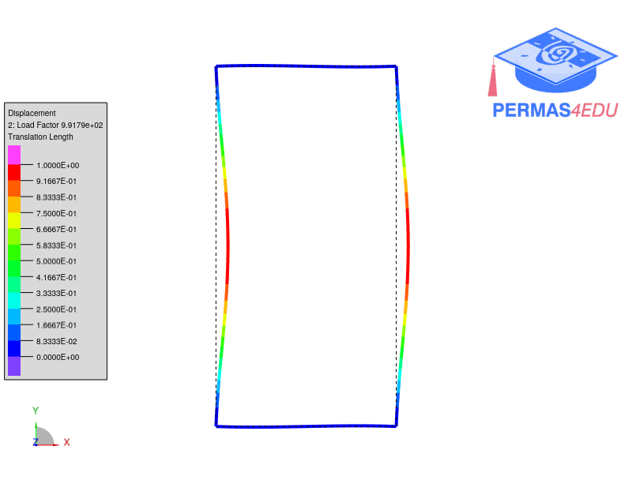

The example is adapted from [Computational simplifications and observations on buckling modes of polygonal ring frames under symmetric compressive joint loads](https://doi.org/10.1016/j.istruc.2024.105904)

Thanks to Chisanga Kaluba for sharing underlying finite element models. His support is greatly appreciated.
Hereafter the number of beam elements is reduced to fulfil the limits of the free education edition
i.e. 
$$n_{beam} \le 250$$. 

