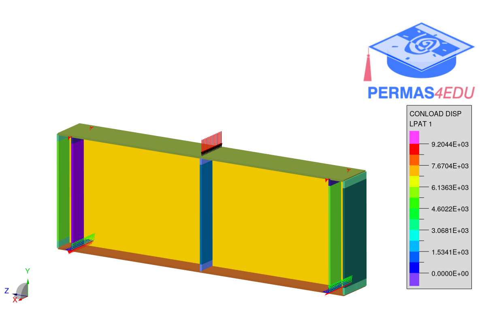

The example is taken from [Shear buckling behaviour of beams with partial-depth stiffeners at the support](https://doi.org/10.1016/j.tws.2024.112622).

Thanks to Gábor Hajdú for sharing the underlying Abaqus model. His support is greatly appreciated.

