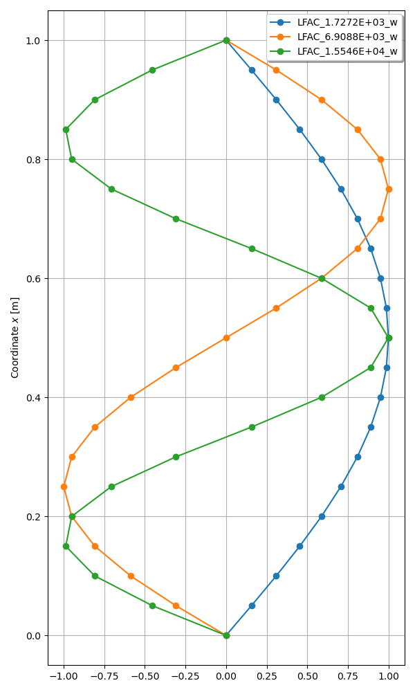
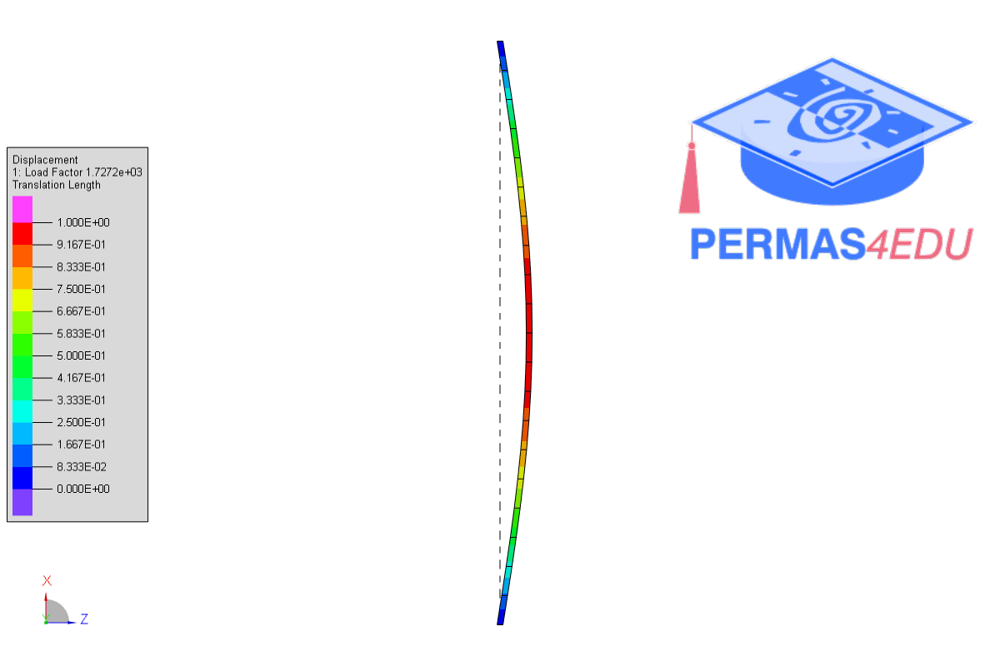

The examples are adapted from [Artificial neural networks for random fields to predict the buckling load of geometrically imperfect structures](https://doi.org/10.1007/s00466-024-02595-w)

### Euler column - Case II

 

### Axially loaded plate

