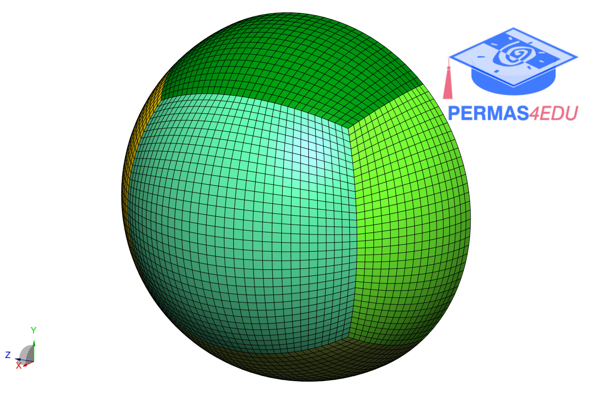
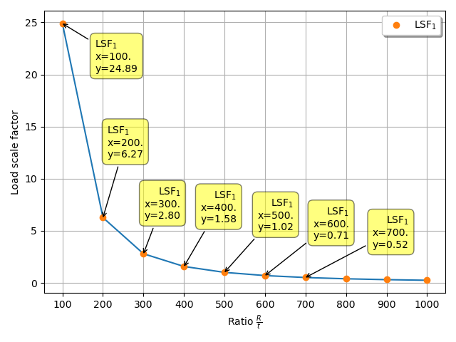

The example is adapted from [UNCERTAINTY QUANTIFICATION OF BUCKLING PROPERTIES FOR IMPERFECT SPHERICAL SHELL SUBJECTED TO EXTERNAL PRESSURE](http://dx.doi.org/10.55579/jaec.202591.477)

### Acknowledgment

Thanks to Ts. Dr.-Ing. Ilyani Akmar Abu Bakar for sharing some finite element models and proviate communication. His support is greatly appreciated.

