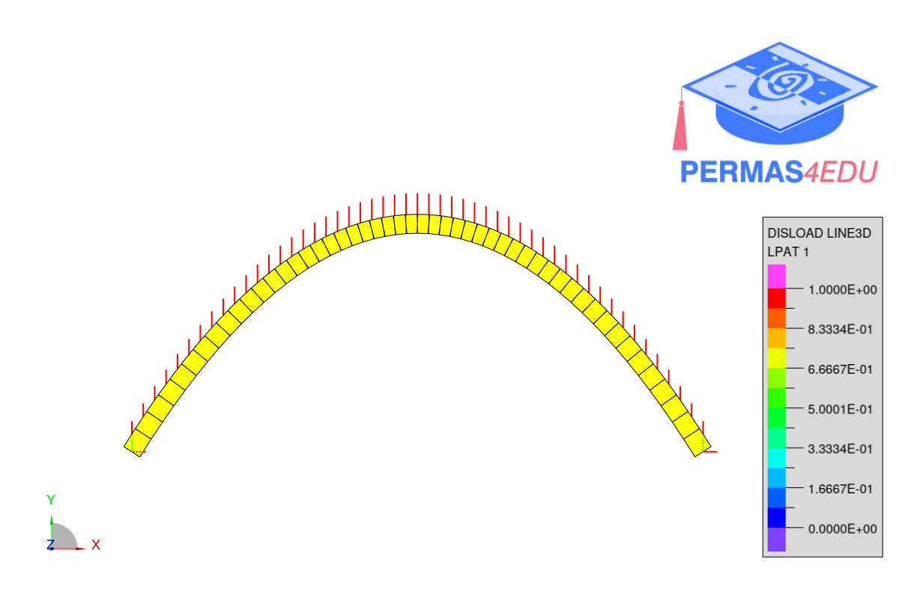

***
[⬅️](../013/README.md "Previous example")
[➡️](../015/README.md "Next example")
***

The example is adapted from [On a remarkable geometric-mechanical synergism based on a novel linear eigenvalue problem](https://doi.org/10.1007/s00707-021-03091-5)

