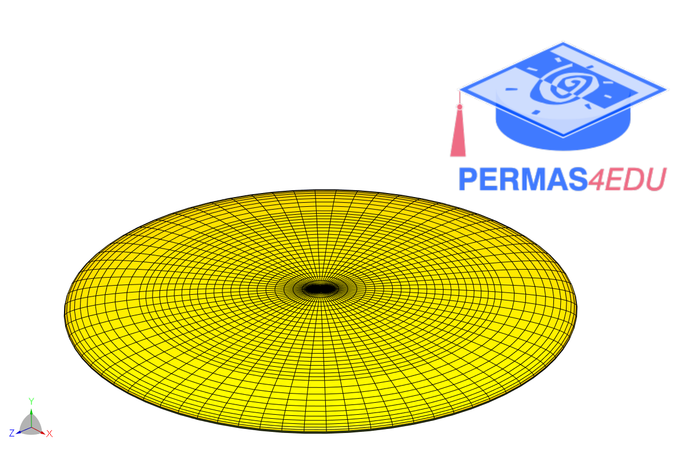

***
[⬅️](../014/README.md "Previous example")
[➡️](../016/README.md "Next example")
***

The example is adapted from [Are the terms stiffening/softening structures mechanically unambiguous?](https://doi.org/10.1016/j.euromechsol.2022.104756)

