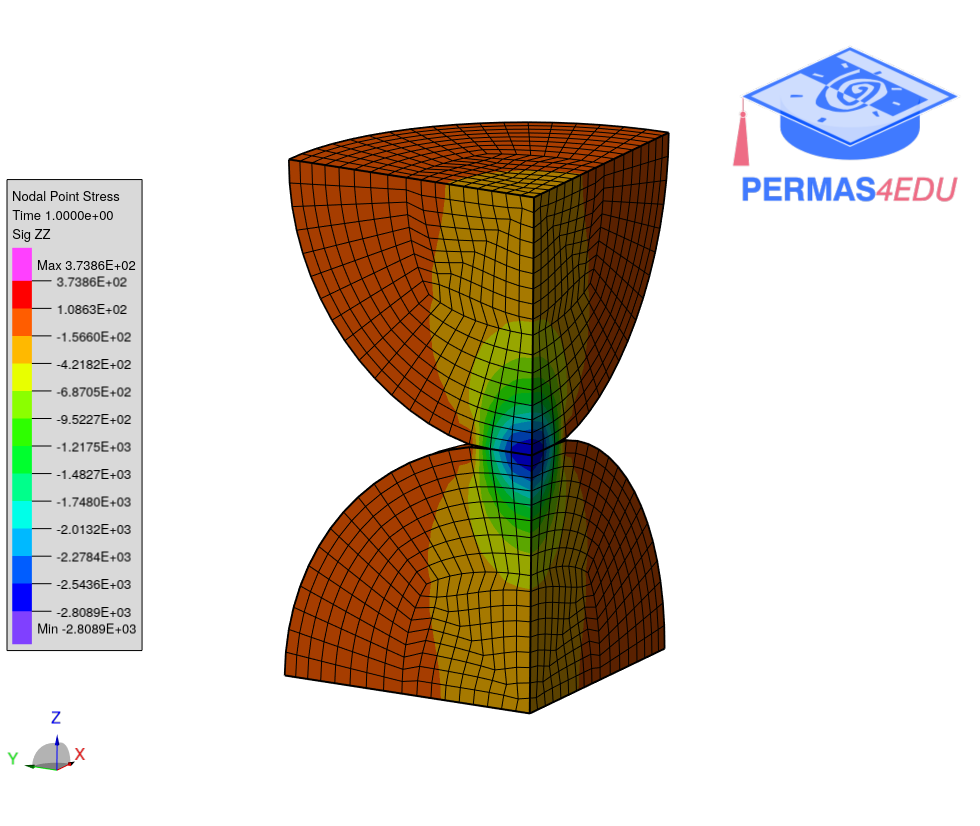
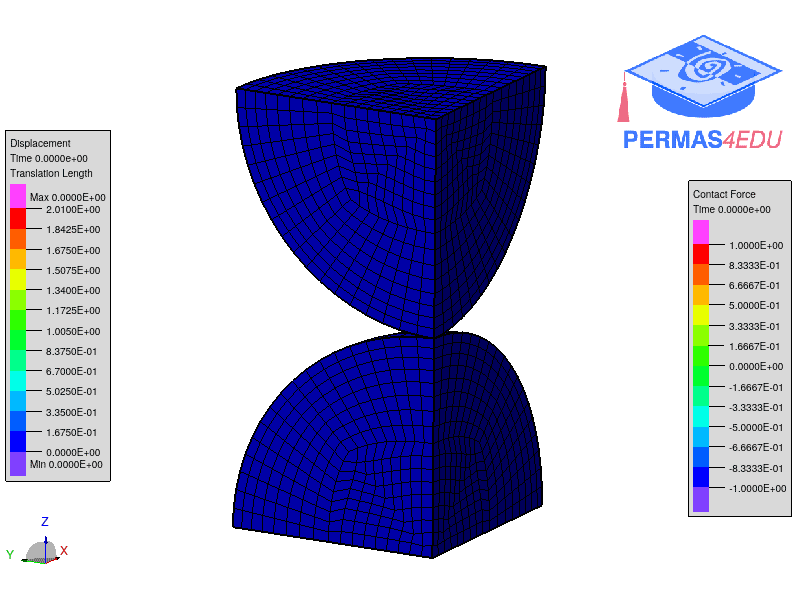

***
[⬅️](../README.md "Go up one directory level")
[➡️](../002/README.md "Next example")
***

The example is adapted from [Validation Case: Hertzian Contact Between Two Spheres](https://www.simscale.com/docs/validation-cases/hertzian-contact-between-two-spheres/)

