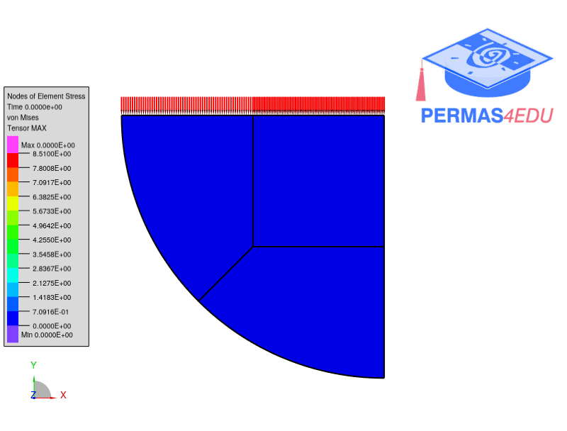

***
[⬅️](../002/README.md "Previous example")
[➡️](../004/README.md "Next example")
***

The example is adapted from [Solving forward and inverse problems of contact mechanics using physics-informed neural networks](https://doi.org/10.1186/s40323-024-00265-3)

