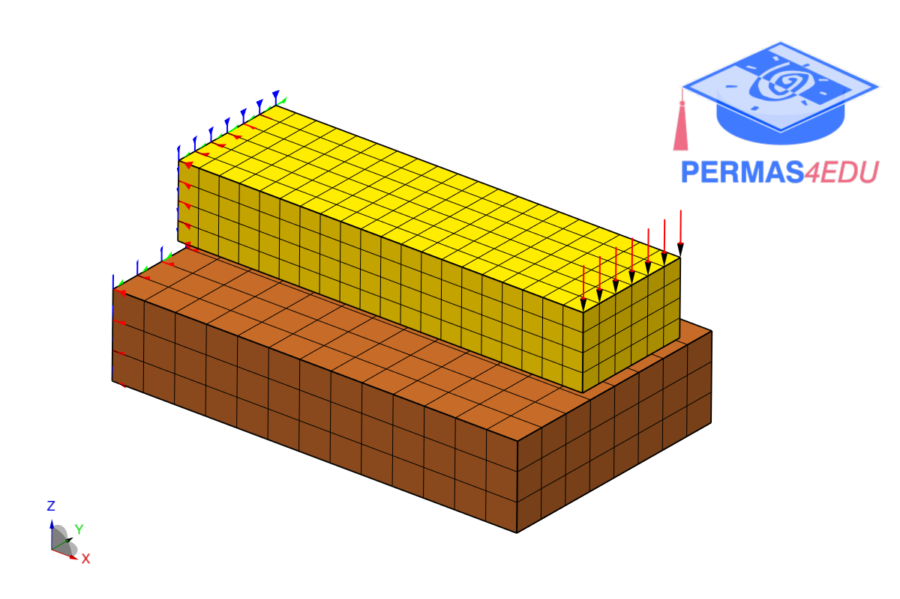
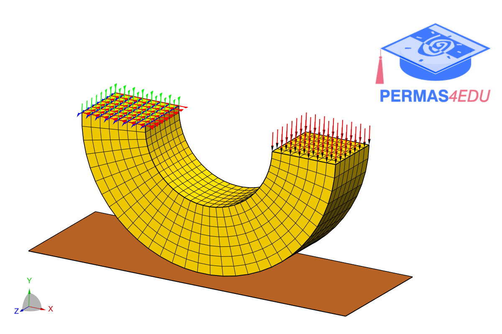

The examples are adapted from [An open source MATLAB solver for contact finite element analysis](https://doi.org/10.1016/j.advengsoft.2024.103798)

Thanks to Wenjie Zuo for private communication.

