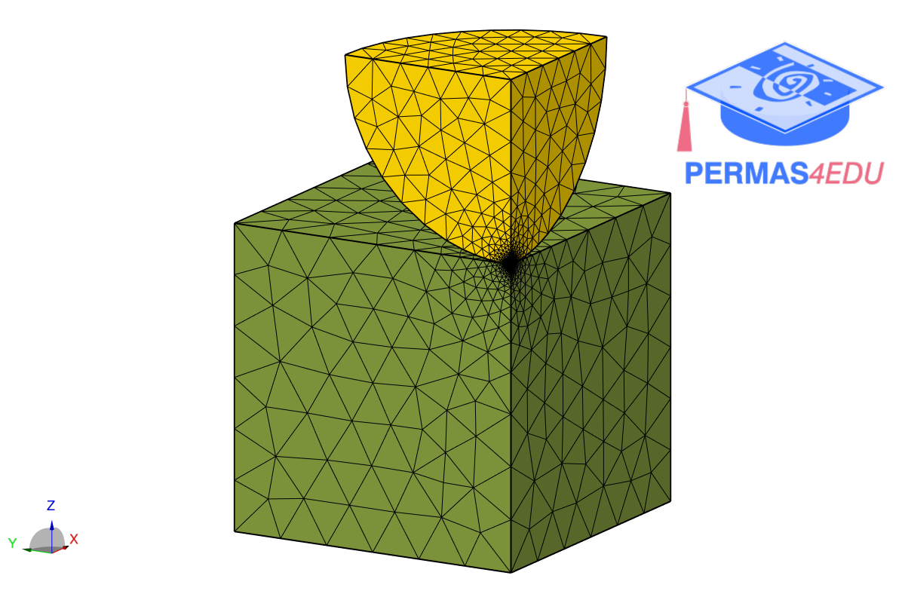

***
[⬅️](../007/README.md "Previous example")
[➡️](../009/README.md "Next example")
***

The example is adapted from [A versatile FEM framework with native GPU scalability via globally-applied AD](https://doi.org/10.48550/arXiv.2602.12365)

