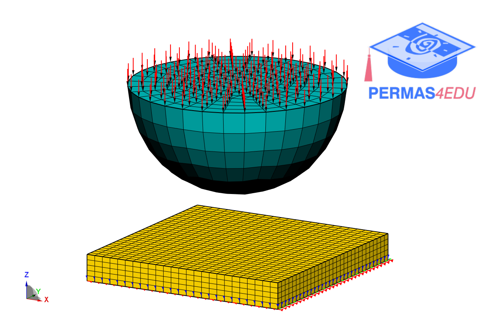

***
[⬅️](../008/README.md "Previous example")
[➡️](../README.md "Go up one directory level")
***

The example is adapted from [Parameter unbounded Uzawa and penalty-splitted accelerated algorithms for frictionless contact problems](https://doi.org/10.48550/arXiv.2603.12205).
Thanks to Daria KOLIESNIKOVA and Isabelle RAMIÈRE for private communication and sharing the underlying finite element models. Their support is greatly appreciated.

