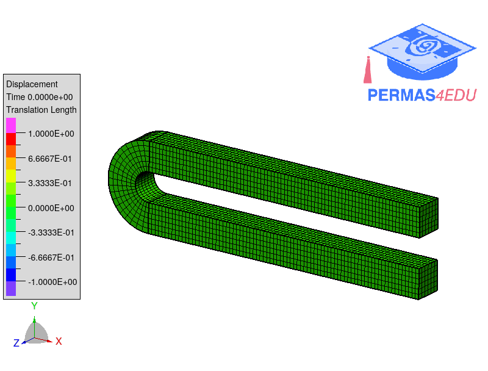

***
[⬅️](../009/README.md "Previous example")
[➡️](../011/README.md "Next example")
***

The example is adapted from [A Robust and Adaptive Isogeometric Framework for Large Deformation Self-Contact Problems](https://doi.org/10.1002/nme.70328)

