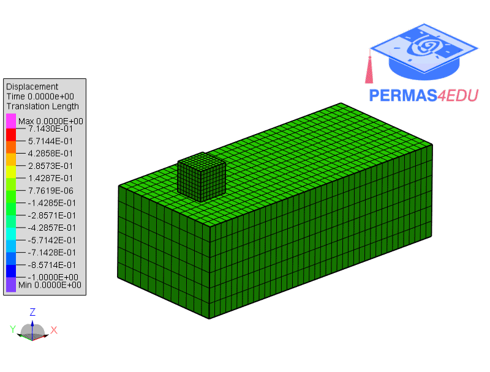

***
[⬅️](../010/README.md "Previous example")
[➡️](../012/README.md "Next example")
***

The example is adapted from [ALGEBRAIC MULTIGRID WITH FILTERING: AN EFFICIENT PRECONDITIONER FOR INTERIOR POINT METHODS IN LARGE-SCALE CONTACT MECHANICS OPTIMIZATION](https://doi.org/10.1137/25M1763159)

