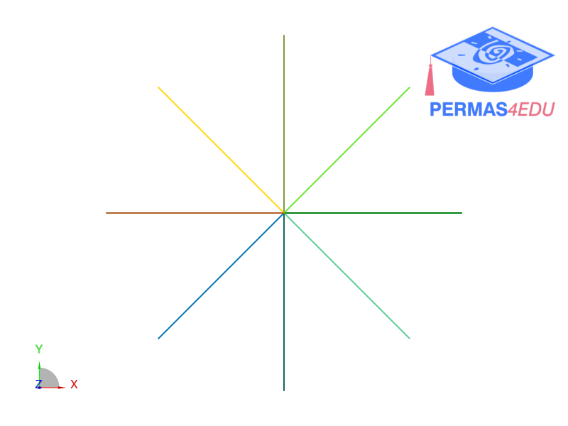

***
[⬅️](../002/README.md "Previous example")
[➡️](../004/README.md "Next example")
***

# NAFEMS Benchmark FV2
A pin-ended double cross, in-plane vibration problem. 
$$E=200 \cdot 10^9 \frac{\textrm{N}}{\textrm{m}^2} $$

$$ \rho = 8000 \frac{\textrm{kg}}{\textrm{m}^3} $$

$$ A = b\cdot h = 0.125^2 \textrm{m}^2$$

$$L_i = 5 \textrm{m} \quad \forall i$$

