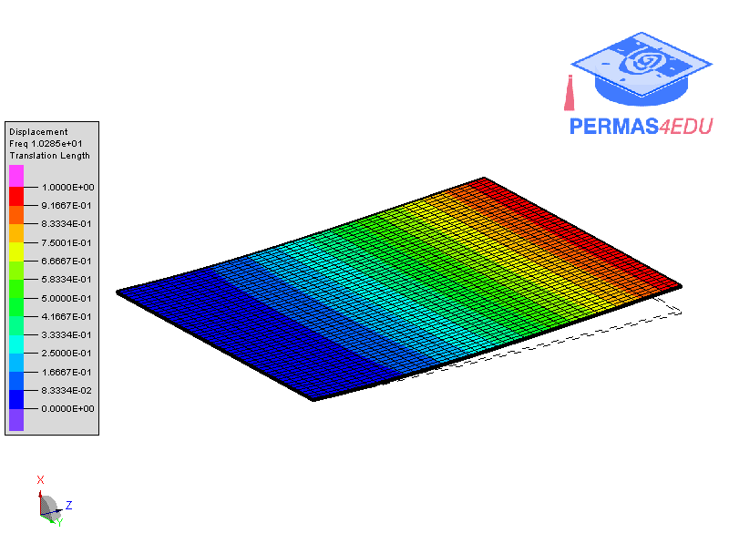

***
[⬅️](../003/README.md "Previous example")
[➡️](../005/README.md "Next example")
***

The example is taken from [Metamodel-assisted hybrid optimization strategy for model updating using
vibration response data](https://doi.org/10.1016/j.advengsoft.2023.103515)
Thanks to Professor Magd Abdel Wahab and Yifei Li for sharing the finite element model. Their support is greatly appreciated.

