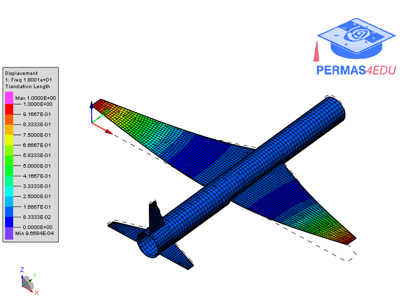

***
[⬅️](../006/README.md "Previous example")
[➡️](../008/README.md "Next example")
***

The example is taken from [Stochastic Model Updating with Uncertainty Quantification: An Overview and Tutorial](https://doi.org/10.1016/j.ymssp.2023.110784)

Thanks to Sifeng Bi for sharing the finite element model. His support is greatly appreciated.

