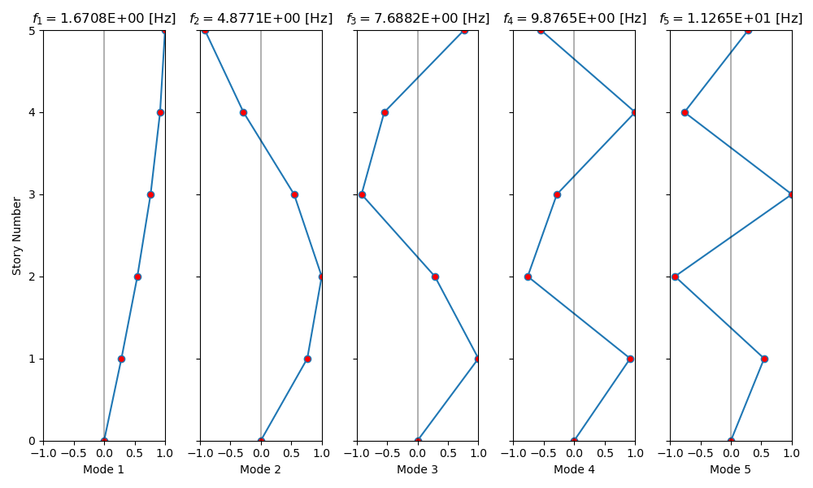

***
[⬅️](../007/README.md "Previous example")
[➡️](../009/README.md "Next example")
***

The example is taken from [Simulation-Based Model-Updating Method for Linear Dynamic Structural Systems](https://doi.org/10.3390/app131810494)

