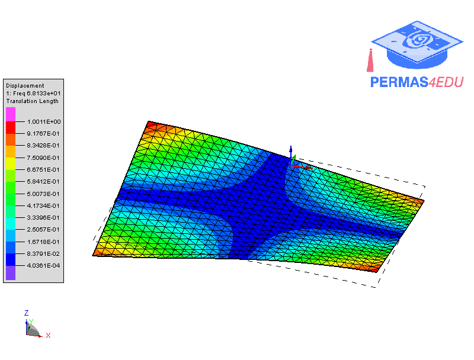

The example is taken from [EfficientModal Identification and Optimal Sensor Placement via Dynamic DICMeasurement and Feature-Based Data Compression](https://doi.org/10.3390/vibration6040050)

Thanks to Weizhuo Wang for sharing the underlying finite element model. His support is greatly appreciated.

