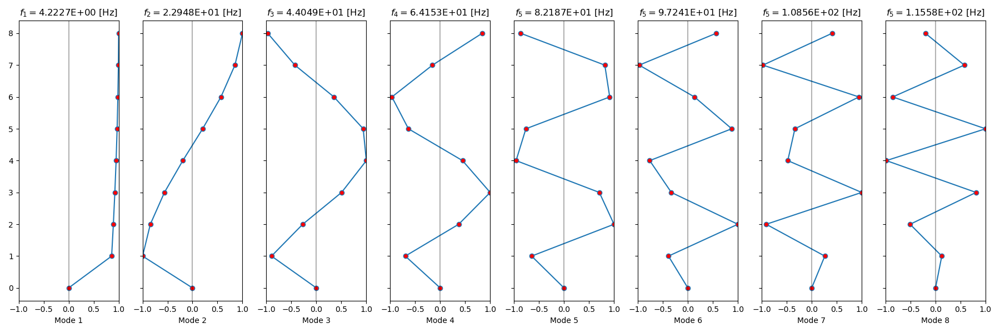
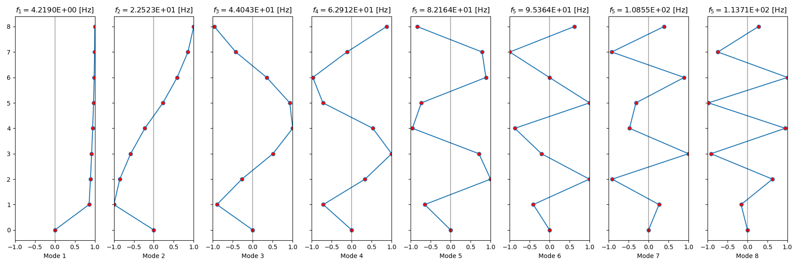
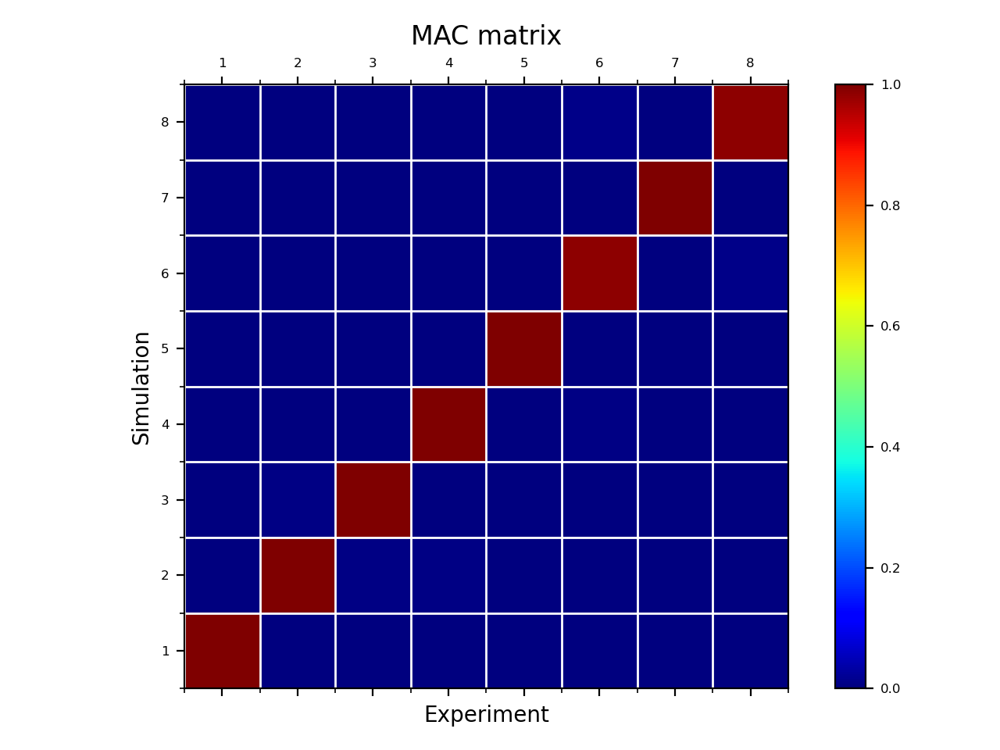

***
[⬅️](../009/README.md "Previous example")
[➡️](../011/README.md "Next example")
***

The example is taken from [The Accuracy and Computational Efficiency of the Loewner Framework for the System Identification of Mechanical Systems](https://doi.org/10.3390/aerospace10060571)

