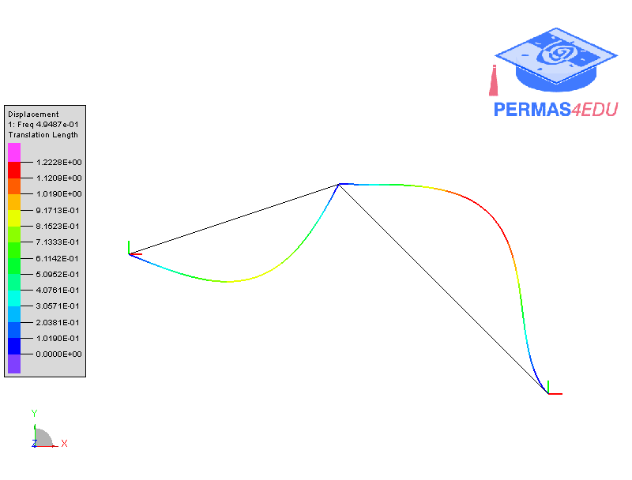

***
[⬅️](../013/README.md "Previous example")
[➡️](../015/README.md "Next example")
***

The example is adapted from [The Numerical Assembly Technique for arbitrary planar beam
structures based on an improved homogeneous solution](https://doi.org/10.1002/pamm.202200059)

