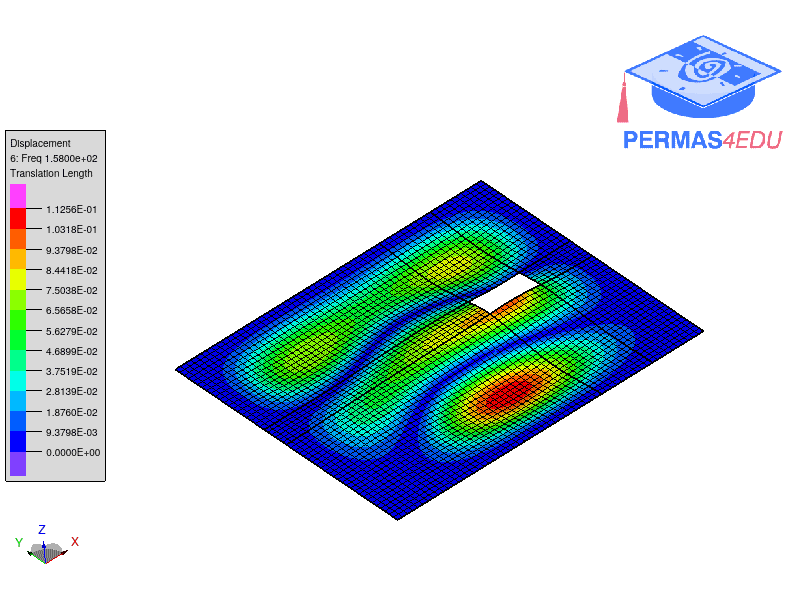

***
[⬅️](../016/README.md "Previous example")
[➡️](../018/README.md "Next example")
***

The example is adapted from [Free Vibration Analysis of Rectangular Plate with Cutouts under Elastic Boundary Conditions in Independent Coordinate Coupling Method](https://doi.org/10.32604/cmes.2022.021340)

$$a=1.2 m, b = 1 m, a_c = 0.2 m, b_c = 0.1 m, r_x=0.8 m, r_y =0.5 m $$
