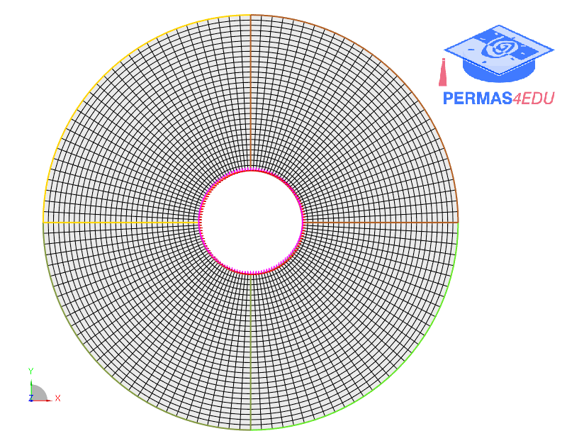

***
[⬅️](../018/README.md "Previous example")
[➡️](../020/README.md "Next example")
***

The example is adapted from [Vibration characteristics of eccentric annular plates](https://doi.org/10.1016/j.tws.2023.111043)

Herein, the eccentricity of the annular plate is described by a mesh morphing approach.

 
