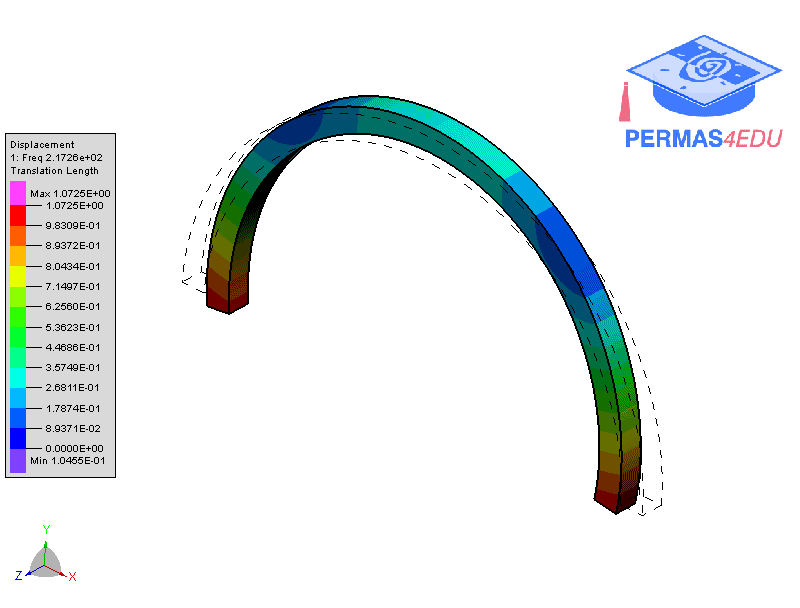
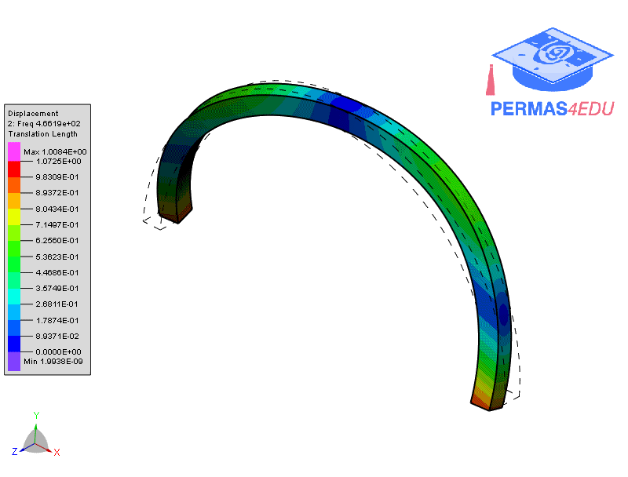
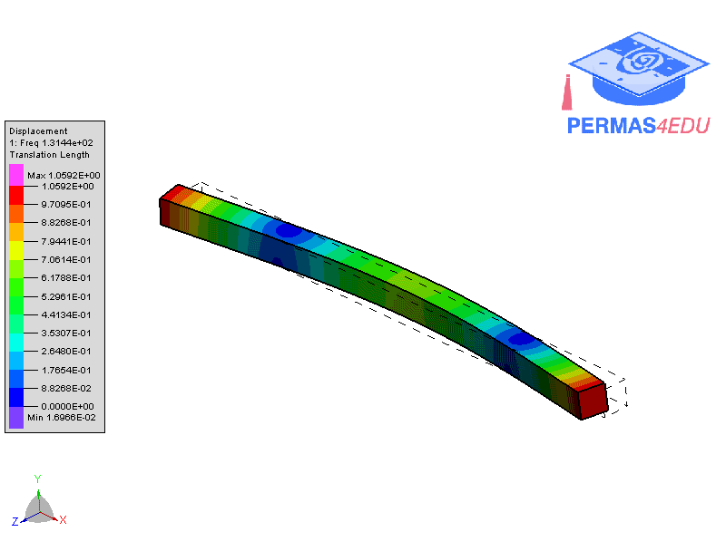
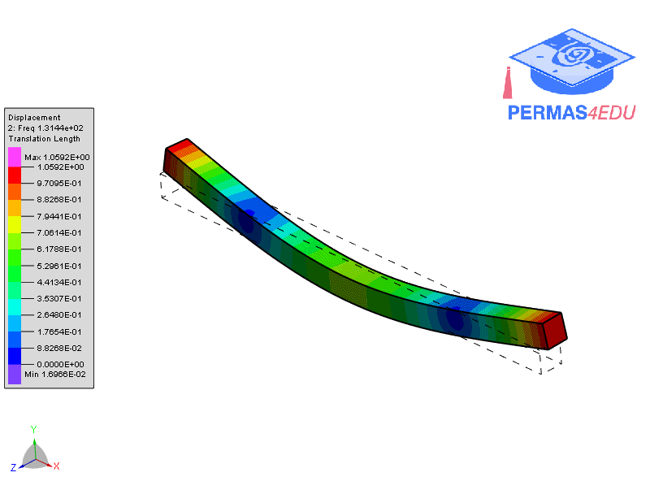

***
[⬅️](../019/README.md "Previous example")
[➡️](../021/README.md "Next example")
***

The example is adapted from [Free vibration analysis of thin to thick straight or curved beams by a solid-3D beam finite element method](https://doi.org/10.1016/j.tws.2023.111028)

