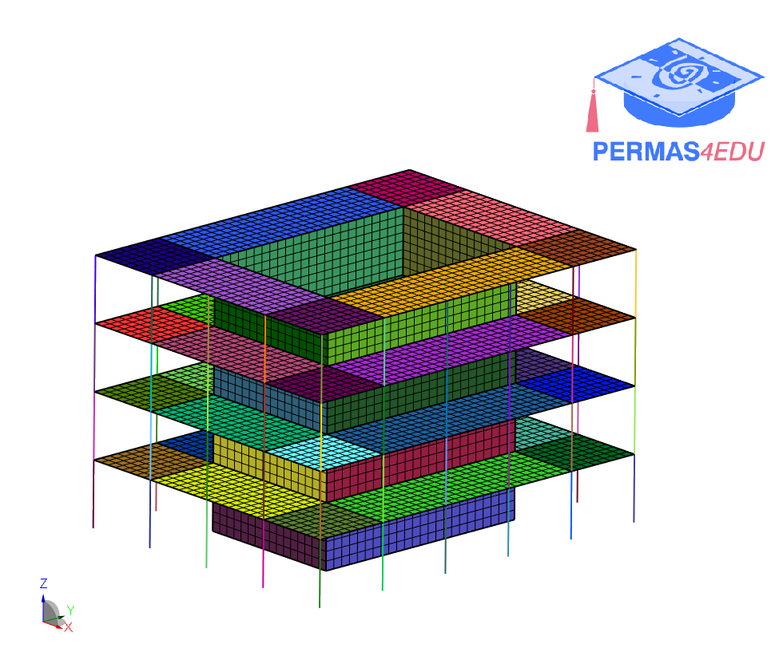

***
[⬅️](../023/README.md "Previous example")
[➡️](../025/README.md "Next example")
***

The example is taken from [Interface reduction technique for Enhanced Craig-Bampton method](https://doi.org/10.1016/j.ymssp.2023.111074)

 plate")

