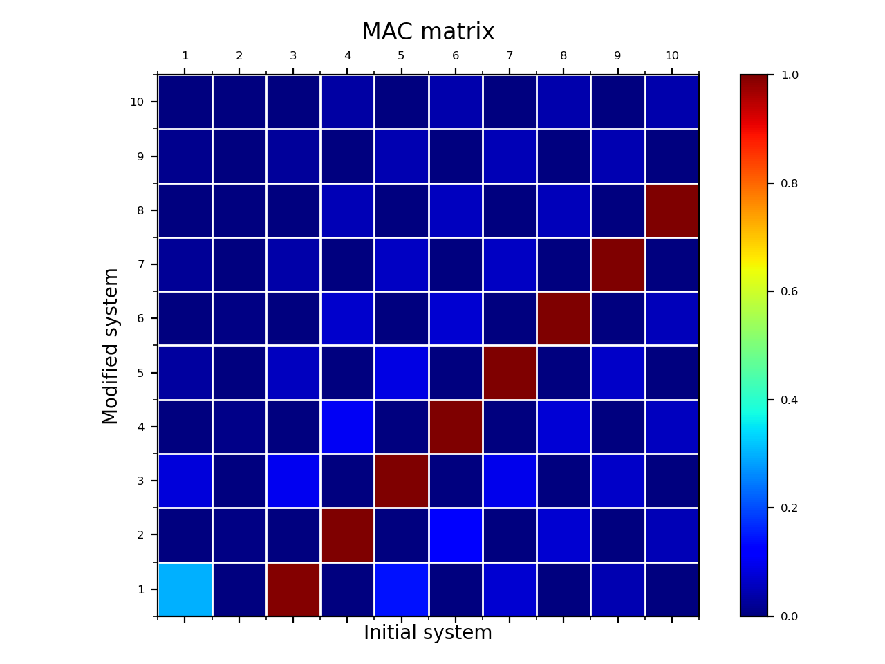

***
[⬅️](../025/README.md "Previous example")
[➡️](../027/README.md "Next example")
***

The example is taken from [Reducing effects of boundary condition in modal testing of flexible structures](https://doi.org/10.1007/s12206-023-1208-9)

