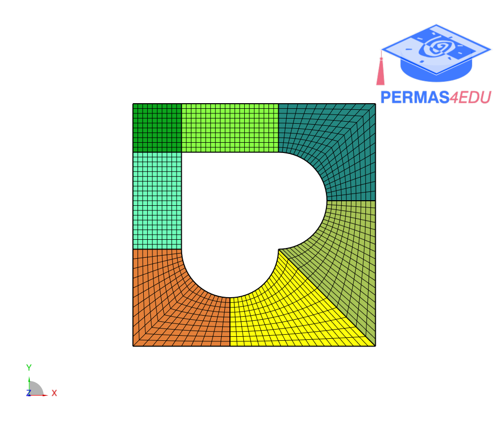
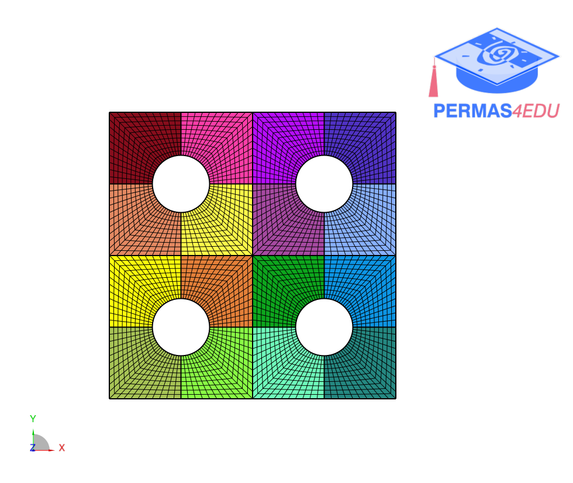

***
[⬅️](../026/README.md "Previous example")
[➡️](../028/README.md "Next example")
***

The examples are adapted from [A novel spectral element method with a higher-order coarse quad meshing approach to design laminated composite panels with arbitrarily shaped cutouts](https://doi.org/10.1016/j.tws.2024.111636)
Thanks to Bekir Bediz for private communication and result comparison.

