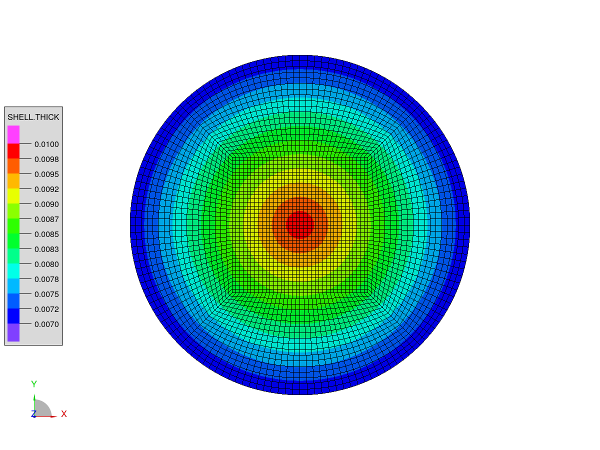

***
[⬅️](../027/README.md "Previous example")
[➡️](../029/README.md "Next example")
***

The example is adapted from [Free vibration of variable-thickness plates via adaptive finite elements](https://doi.org/10.1016/j.jsv.2024.118336)

