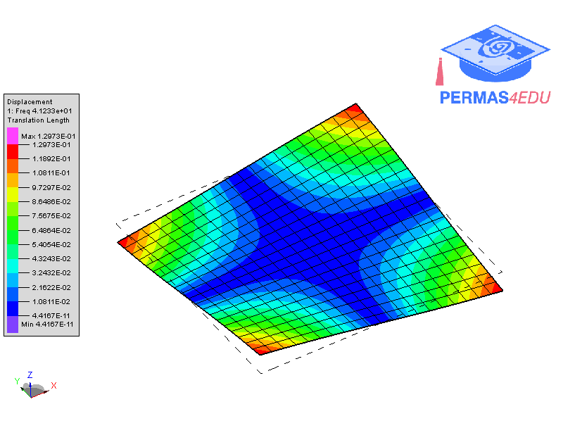

***
[⬅️](../028/README.md "Previous example")
[➡️](../030/README.md "Next example")
***

The example is adapted from [Multi-Objective Sensor Placement Optimization in SHM Systems with Kriging-Based Mode Shape Interpolation](https://doi.org/10.1016/j.ymssp.2024.111150)

