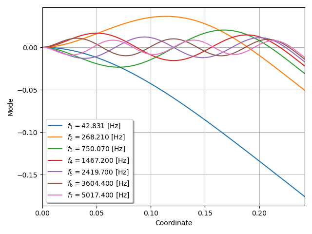

***
[⬅️](../030/README.md "Previous example")
[➡️](../032/README.md "Next example")
***

The example is adapted from [Optimization of Sensor Placement for Modal Testing Using Machine Learning](http://dx.doi.org/10.20944/preprints202403.0604.v1)

