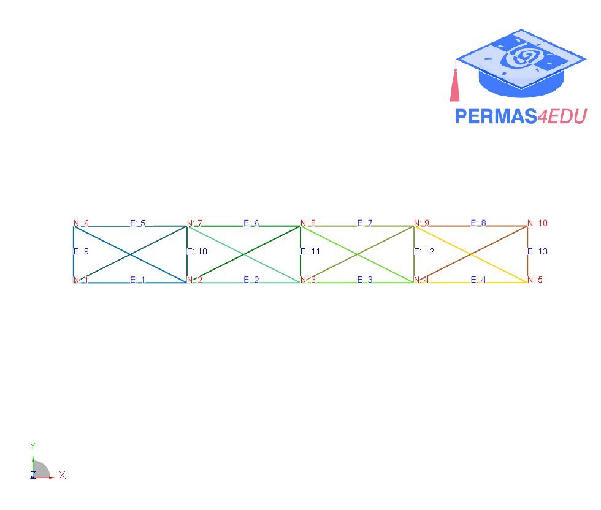
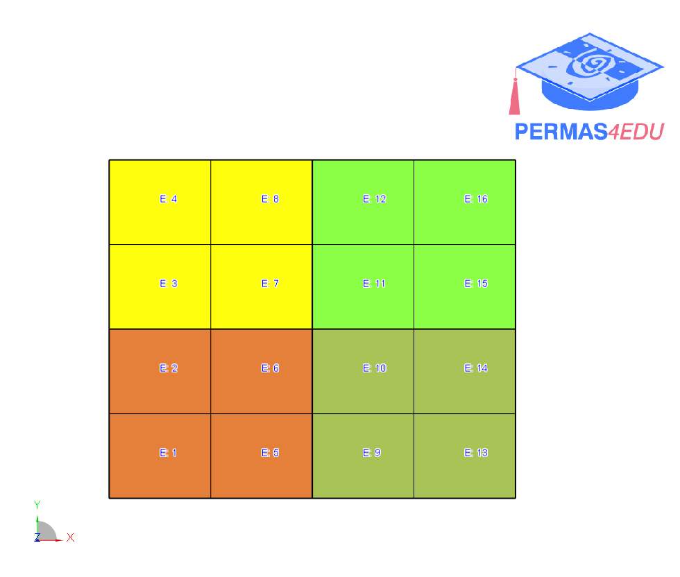

***
[⬅️](../033/README.md "Previous example")
[➡️](../035/README.md "Next example")
***

The example is adapted from [Finite element model updating and damage detection using strain-based modal data in the Bayesian framework](https://doi.org/10.1016/j.jsv.2024.118457)

