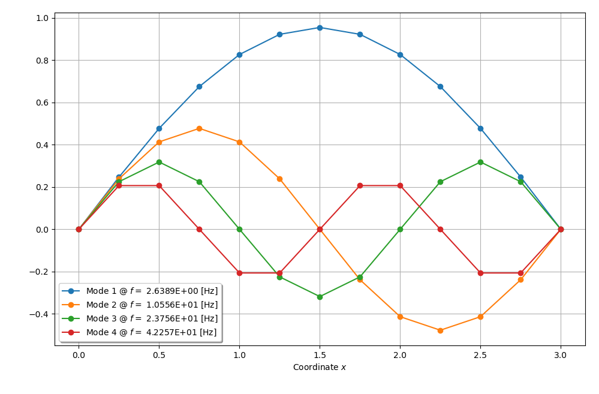

***
[⬅️](../038/README.md "Previous example")
[➡️](../040/README.md "Next example")
***

The example is adapted from [Physics-guided deep learning based on modal sensitivity for structural damage identification with unseen damage patterns](https://doi.org/10.1016/j.engstruct.2024.118510)

