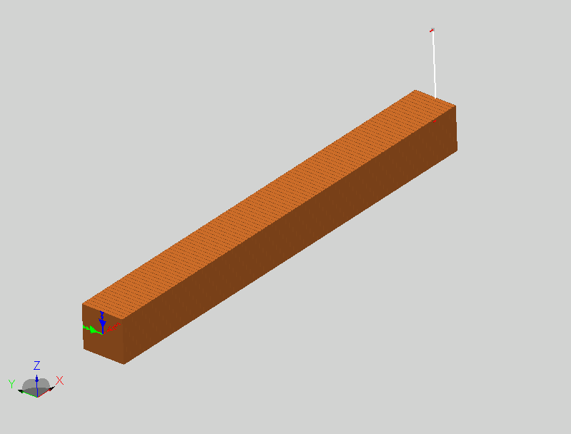

***
[⬅️](../040/README.md "Previous example")
[➡️](../042/README.md "Next example")
***

The example is adapted from [Additional Natural Frequency of the Beam Carrying a Spring-Mass System: Lost and Found](http://dx.doi.org/10.1115/1.4065781)

