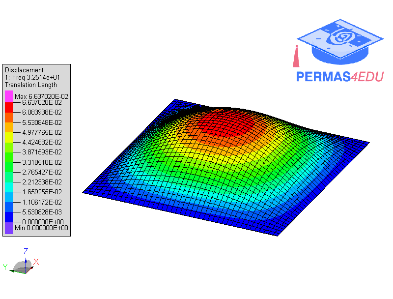

***
[⬅️](../041/README.md "Previous example")
[➡️](../043/README.md "Next example")
***

The example is adapted from [Hybrid finite element theory in dynamic analysis of an imperfect plate](https://doi.org/10.1016/j.mechrescom.2024.104324)

