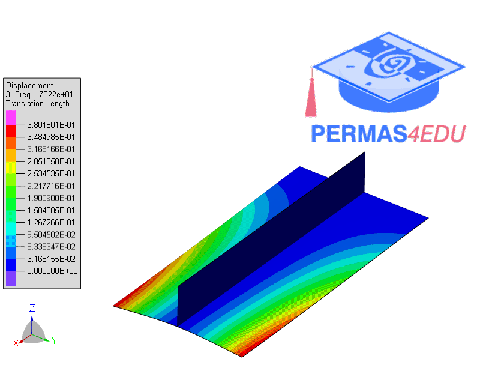
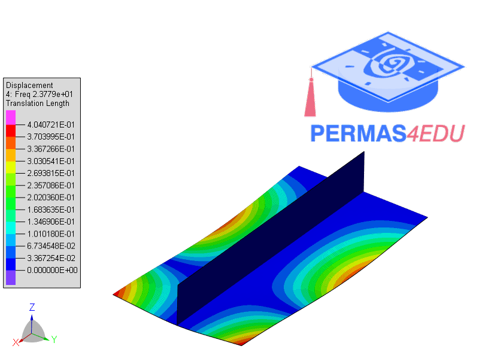
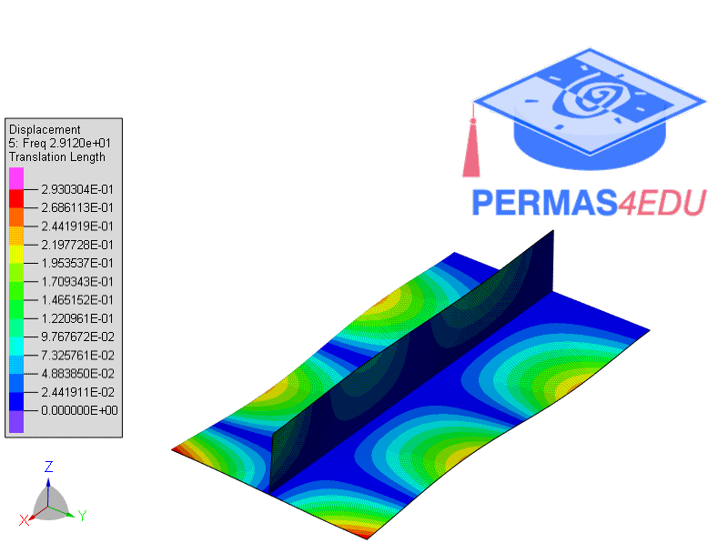

***
[⬅️](../042/README.md "Previous example")
[➡️](../044/README.md "Next example")
***

The example is adapted from [Damage diagnosis of plates and shells through modal parameters reconstruction using inverse finite-element method](http://dx.doi.org/10.1177/14759217241249678)

