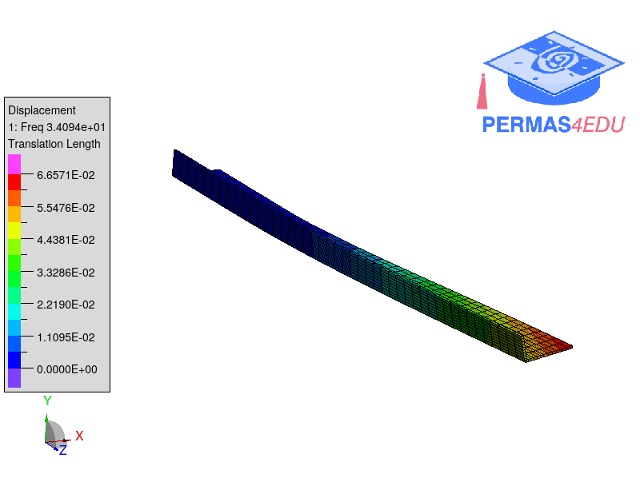
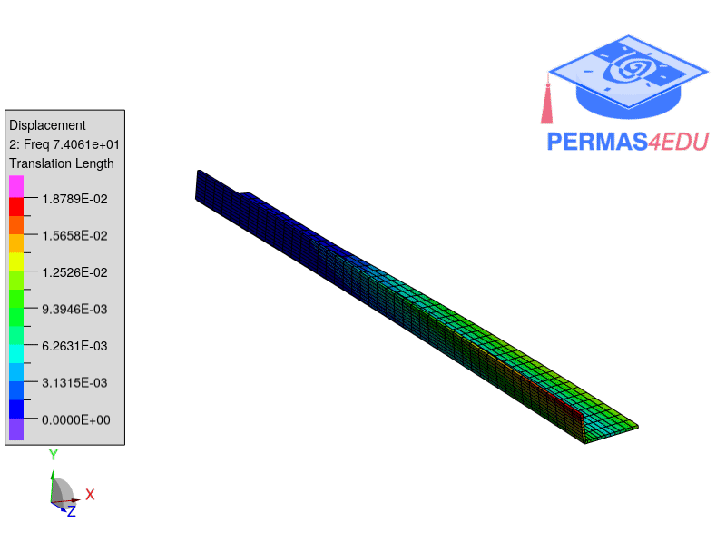
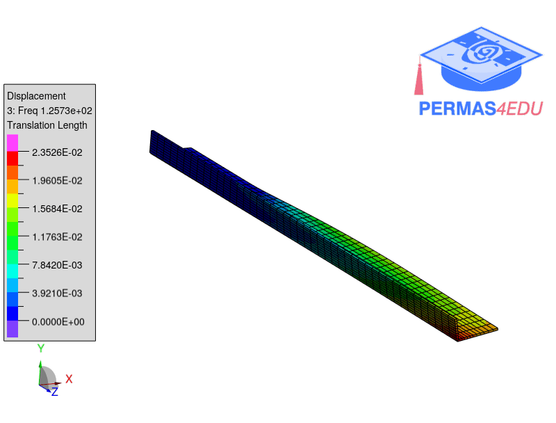

The example is taken from [DIC vibration measurement through smartphone devices](http://dx.doi.org/10.1088/1742-6596/2802/1/012009).
Thanks to Paolo Neri for sharing the Ansys model. His support is greatly appreciated.

