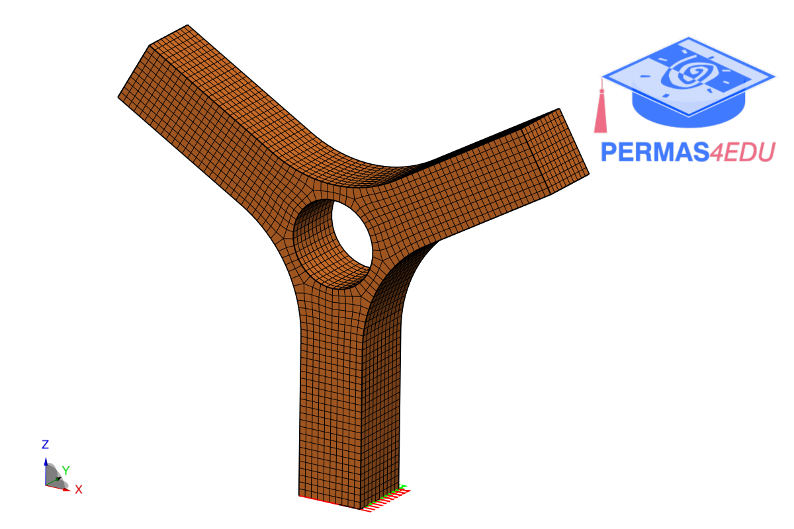

The example is taken from [Application of thermoelasticity in the frequency-domain multiaxial vibration-fatigue criterion](https://doi.org/10.1016/j.ymssp.2024.112002)

Thanks to Janko Slavic for sharing a gmsh model. His support is greatly appreciated.

