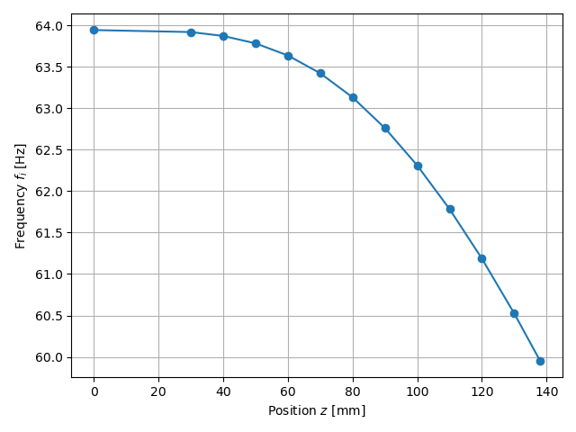

***
[⬅️](../049/README.md "Previous example")
[➡️](../051/README.md "Next example")
***

The example is adapted from [Application of Quantum Perturbation Method to Euler-Bernoulli Equation for Frequency Shift in Non-Uniform Cantilever Oscillations](http://dx.doi.org/10.2139/ssrn.4779171)

