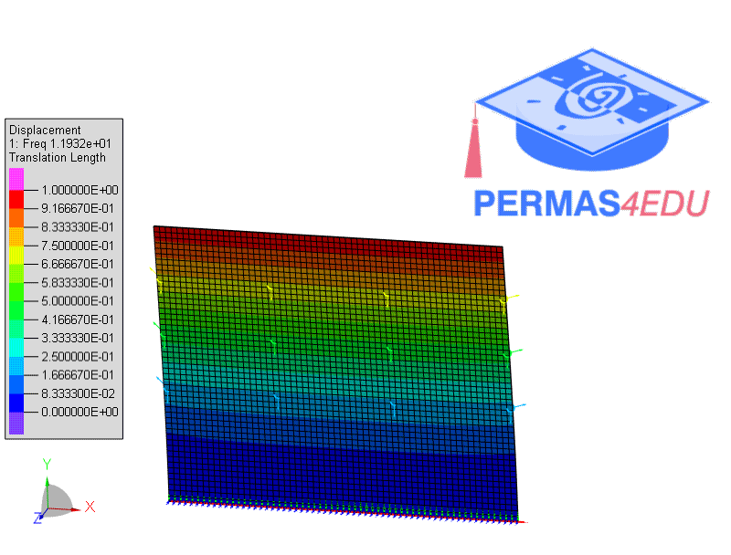
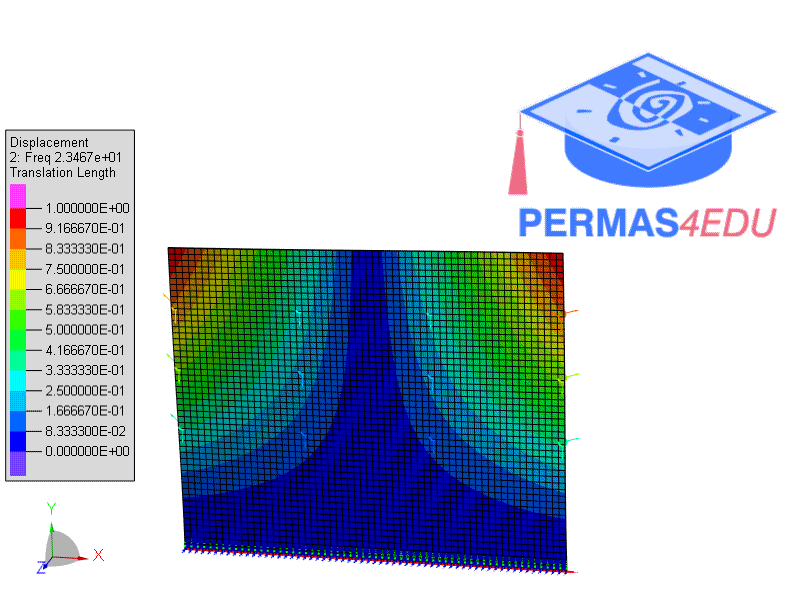
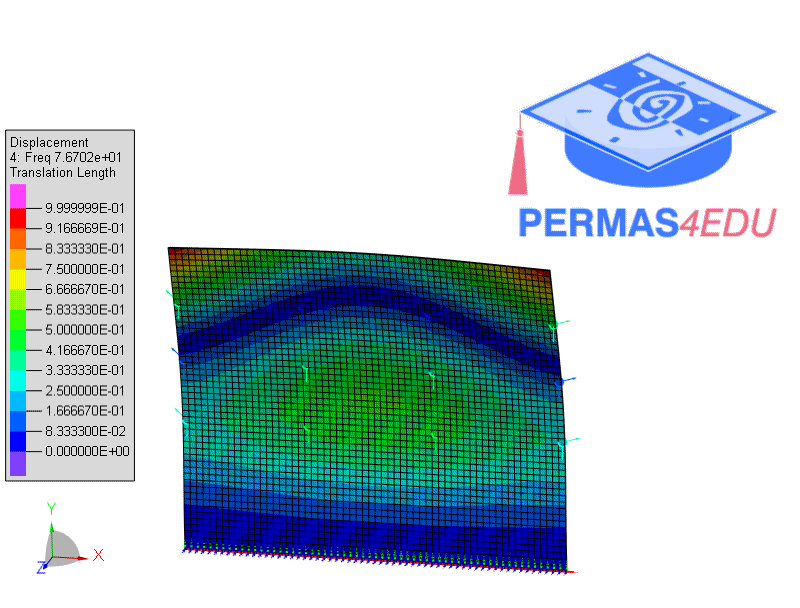

***
[⬅️](../052/README.md "Previous example")
[➡️](../054/README.md "Next example")
***

The example is adapted from [Modal Complexity Factors as indexes for modal parameter identification in Operational Modal Analysis of coupled dynamic systems](https://doi.org/10.1016/j.jsv.2024.118860)

