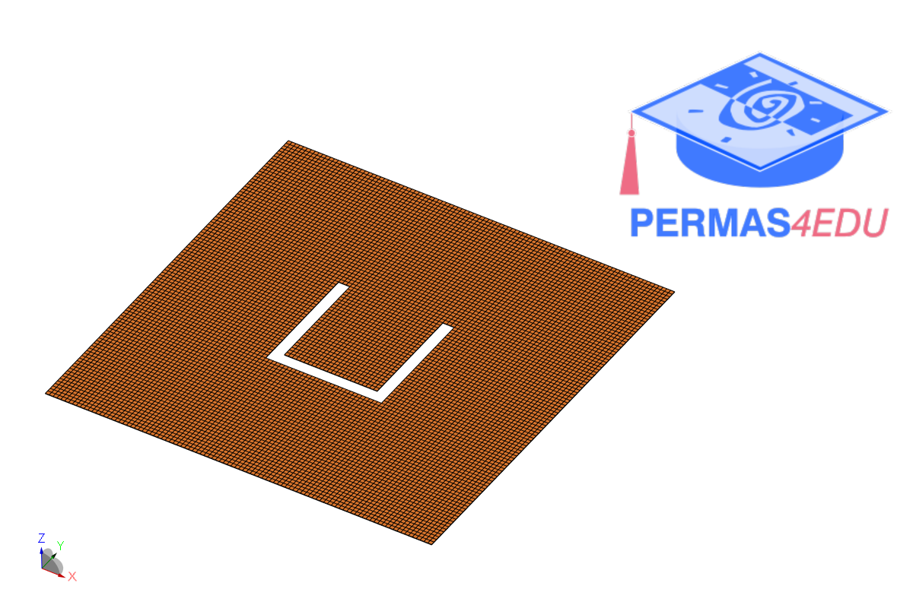

***
[⬅️](../053/README.md "Previous example")
[➡️](../055/README.md "Next example")
***

The example is adapted from [Analysis of the free vibration of thin rectangular plates with cut-outs using the discrete singular convolution method](https://doi.org/10.1016/j.tws.2019.106529)

