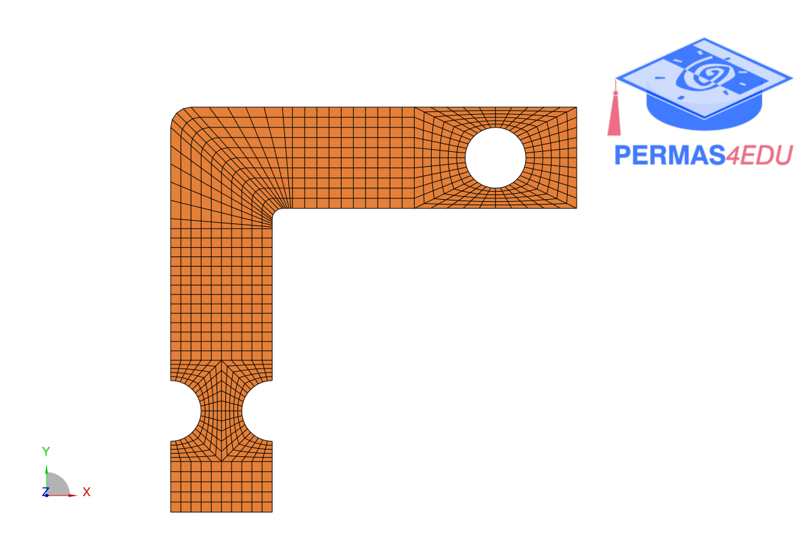
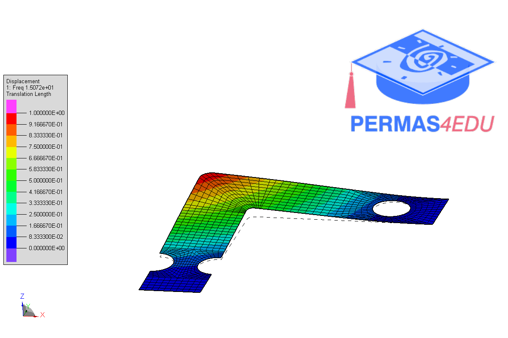

***
[⬅️](../054/README.md "Previous example")
[➡️](../056/README.md "Next example")
***

The example is adapted from [Integrating von Mises and hydrostatic stresses in frequency domain multiaxial fatigue criteria for vibration fatigue analysis](https://doi.org/10.1016/j.ymssp.2024.112229)

