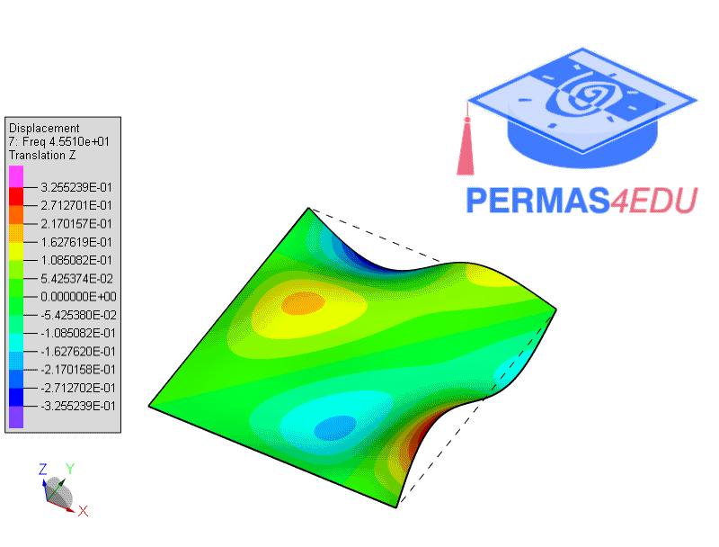
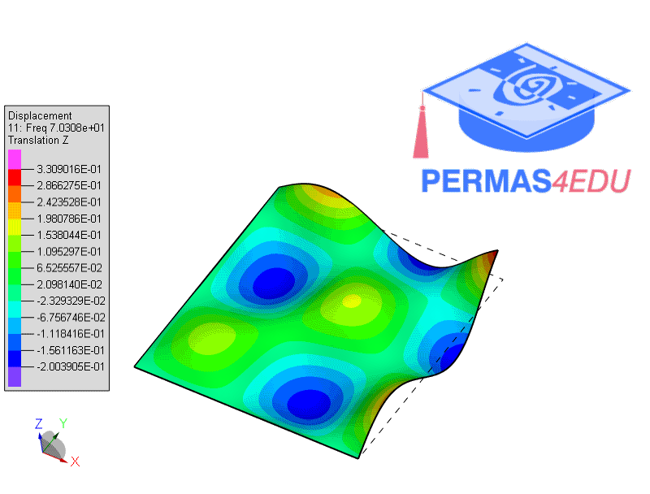

The example is adapted from [Insight Into the Separation-of-Variable Methods for the Closed-Form Solutions of Free Vibration of Rectangular Thin Plates](https://doi.org/10.32604/cmes.2024.056440)

