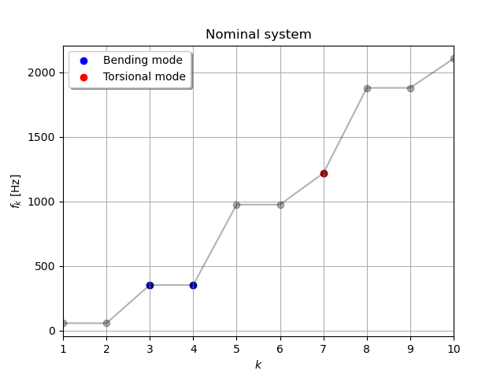
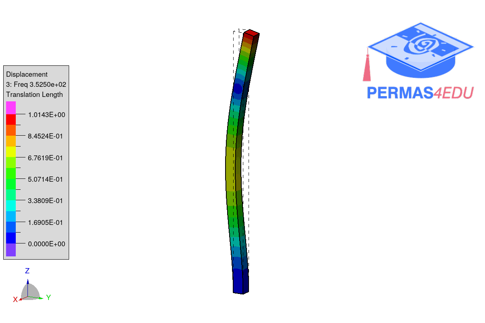
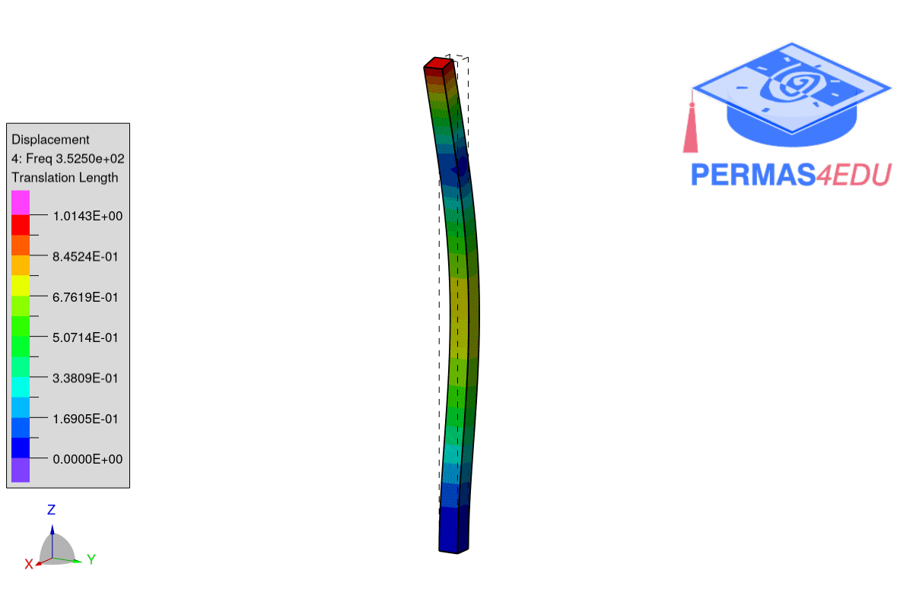
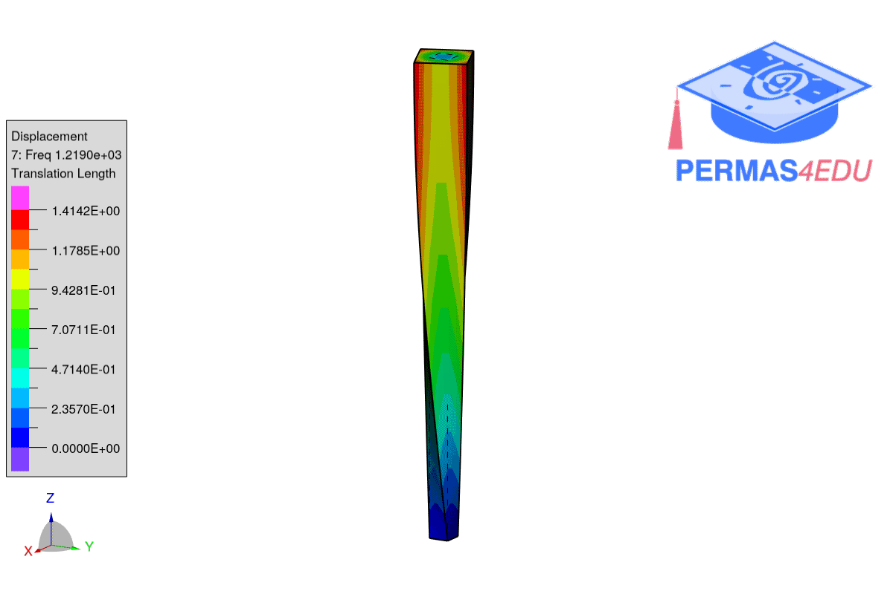

The example is adapted from [Modal properties of mechanical systems under geometric variations by perturbation theory](https://doi.org/10.1016/j.jsv.2025.118942)

Thanks to Javier Luis González Monge for private communication. His support is greatly appreciated.

