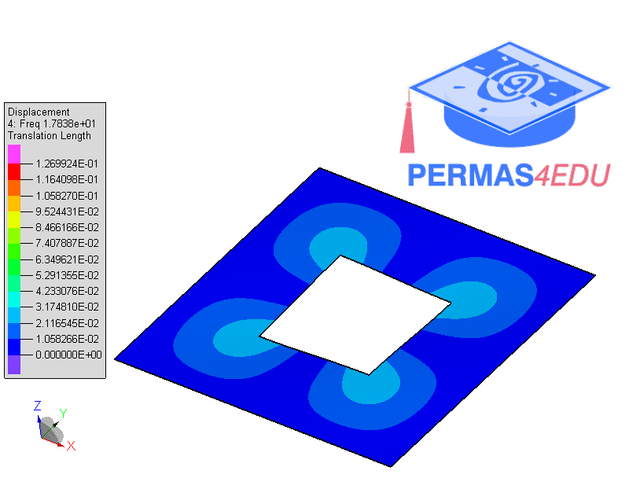
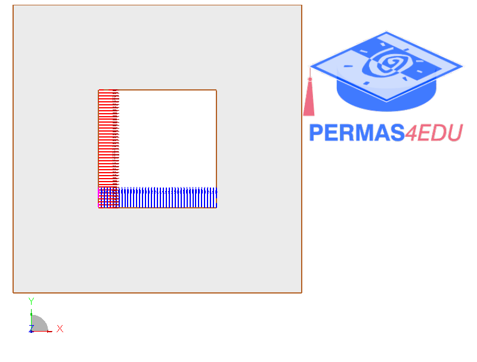

The example is adapted from [Vibration Frequencies of Thin Rectangular Plates with Internal, Edge, and Corner Rectangular Cutouts](https://doi.org/10.1142/S0219455426501014)

$$\alpha=\beta=0.4$$, $$E = 2.1E11 $$, $$a=b=1$$, $$\nu=0.3$$, $$\rho=7800$$, $$h=1.E-3$$

