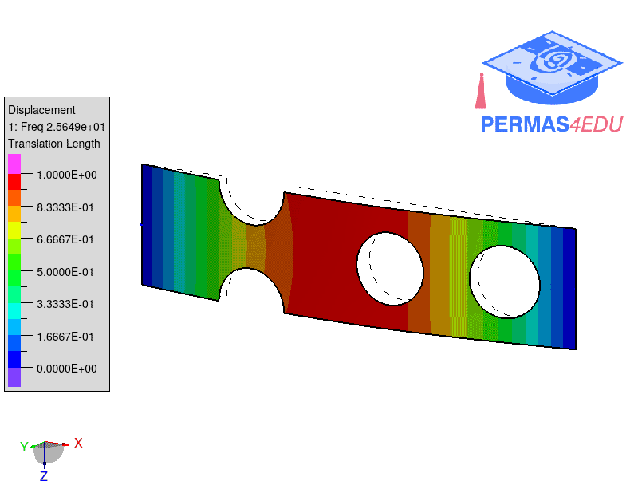
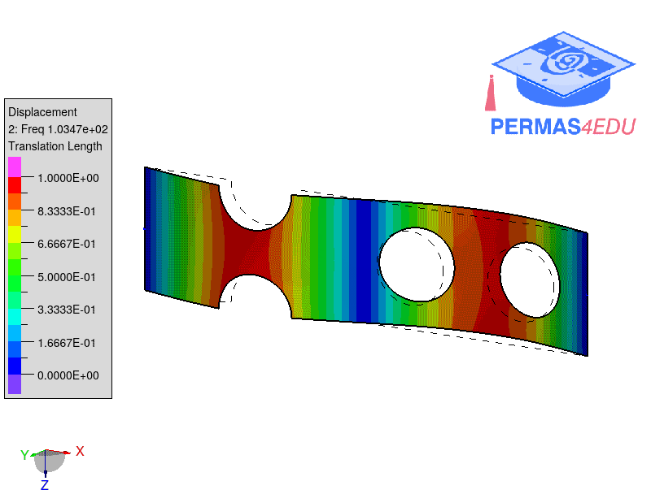
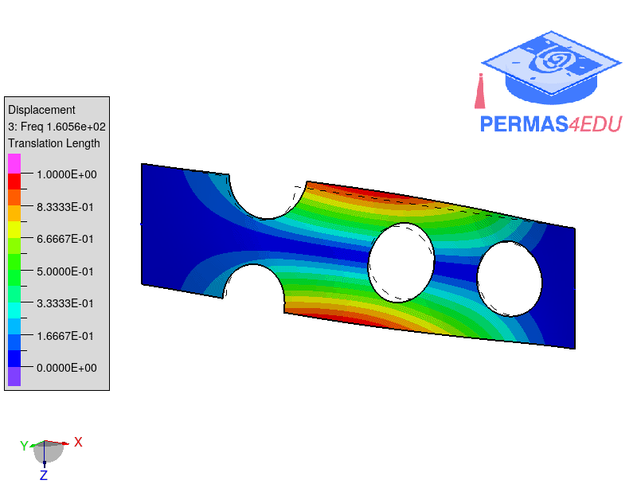
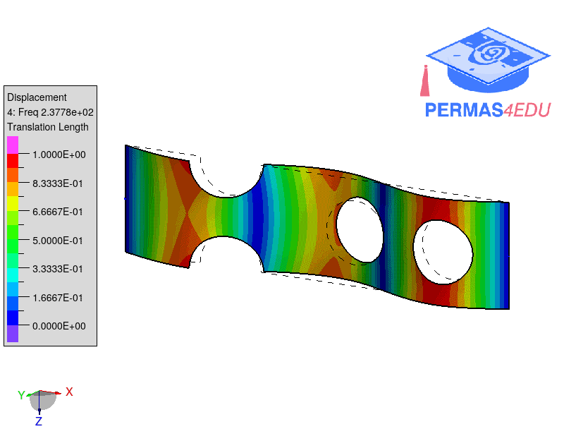
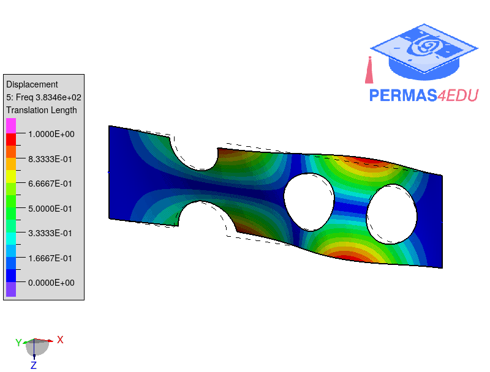

The example is adapted from [Fast evaluation of central moments for non-Gaussian random loads in vibration fatigue](https://doi.org/10.1016/j.ymssp.2025.112434)

Thanks to Janko Slavic and Massimiliano Palmieri for private communication. The support is greatly appreciated.

