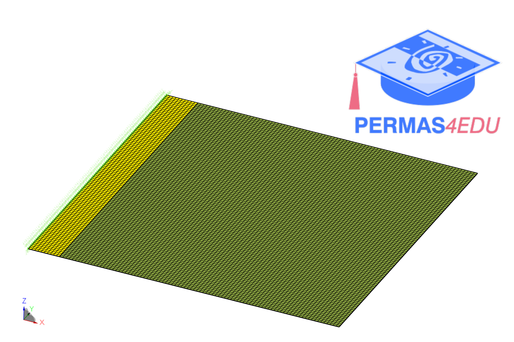
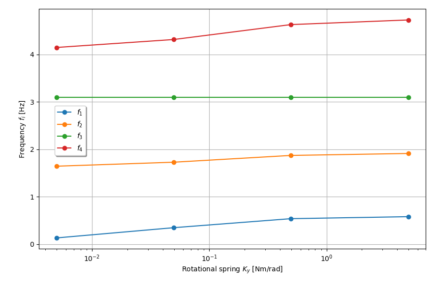

***
[⬅️](../062/README.md "Previous example")
[➡️](../064/README.md "Next example")
***

The example is adapted from [Free vibration solutions of rotationally restrained stepped thick rectangular plates utilizing a symplectic analytical framework](https://doi.org/10.1016/j.apm.2025.116044)
Thanks to Rui Li and Yueqing Shi for private communication.

