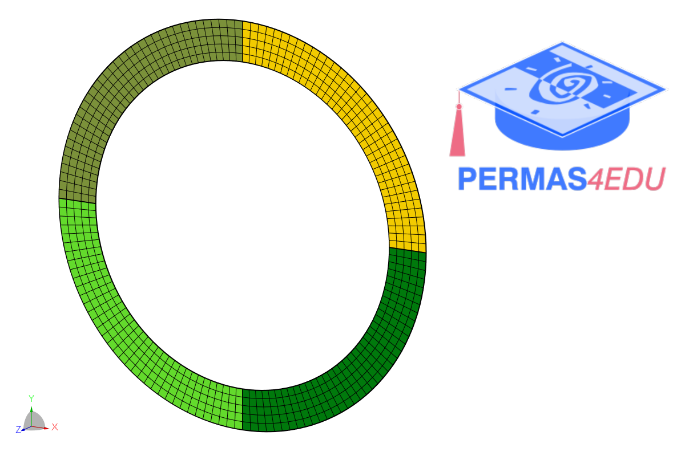
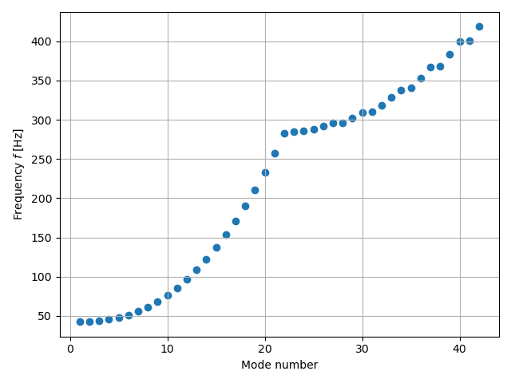

***
[⬅️](../064/README.md "Previous example")
[➡️](../066/README.md "Next example")
***

The example is adapted from [Probabilistic uncertainty modeling at the elemental level for linear structural dynamics](https://doi.org/10.1007/s00466-025-02615-3).
Thanks to Marc Mignolet for private communication.

