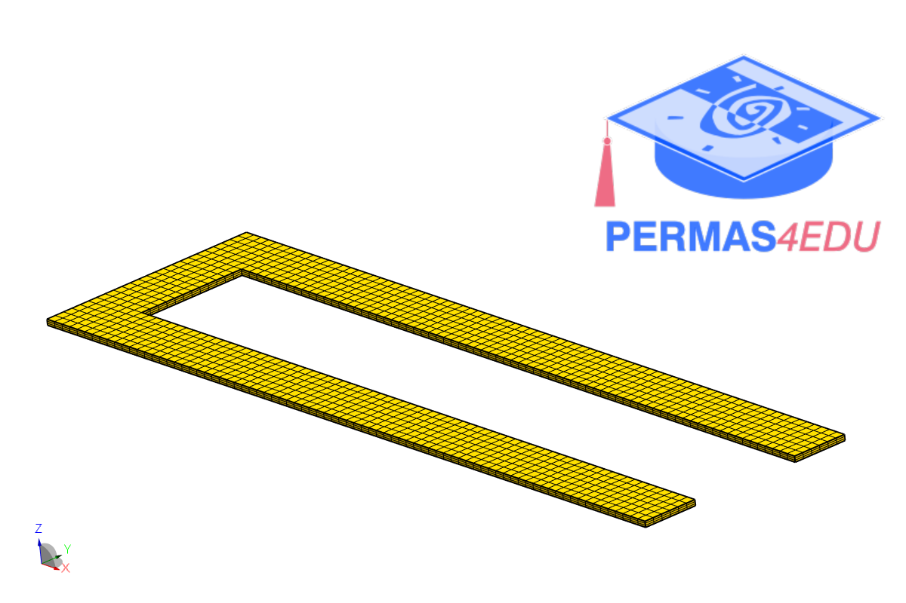
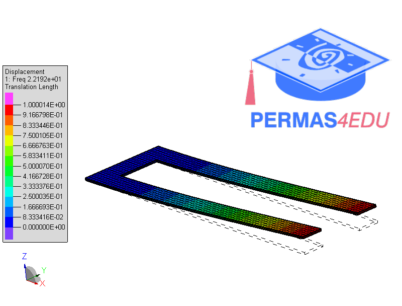
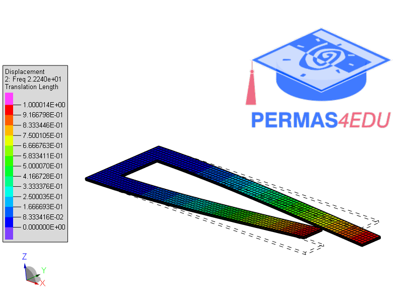
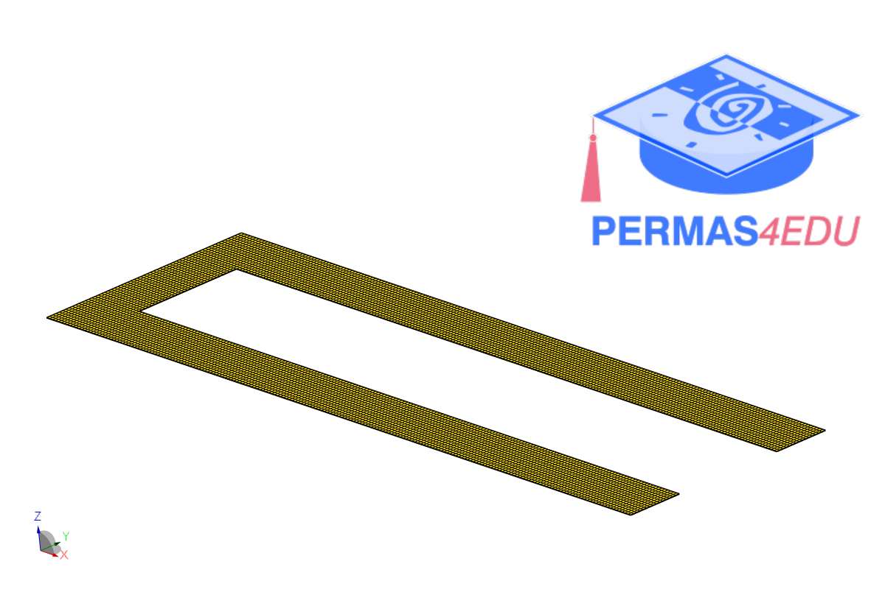
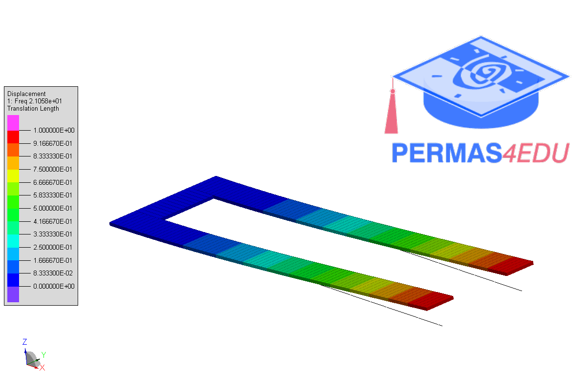
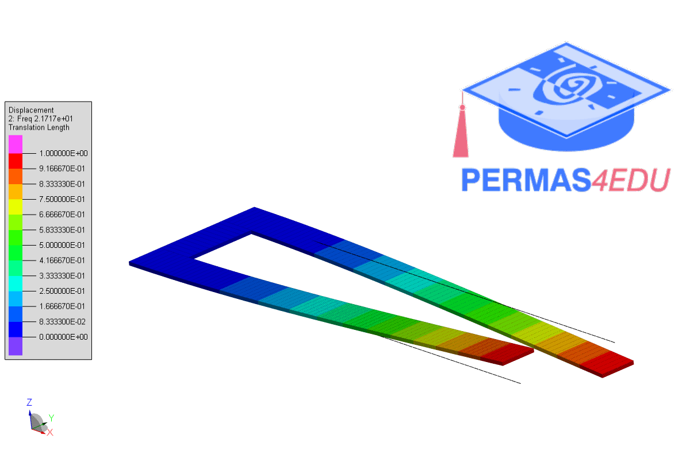

***
[⬅️](../065/README.md "Previous example")
[➡️](../067/README.md "Next example")
***

The examples are adapted from [Vibration energy transfer in nonlinear coupled near-identical systems](https://doi.org/10.1016/j.ymssp.2025.112786)

### Solid model

### Shell model

### Beam model

