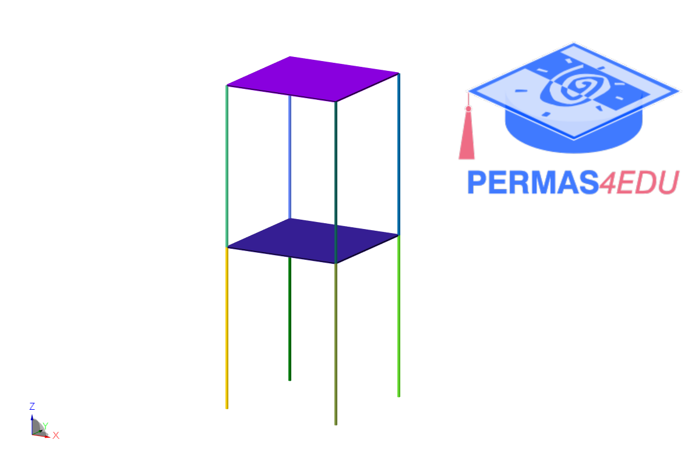
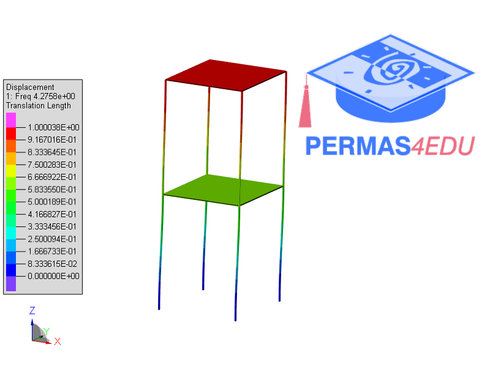
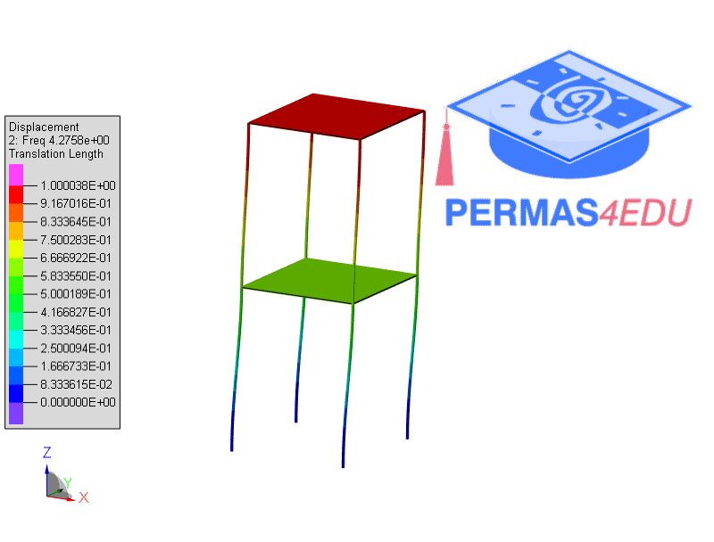
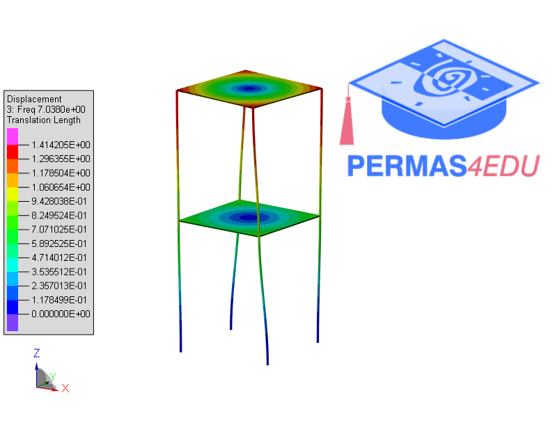

***
[⬅️](../069/README.md "Previous example")
[➡️](../071/README.md "Next example")
***

The example is adapted from [The ROTMAC Concept: An Experimental Application](https://iomac2025.sciencesconf.org/590944/document)

### Two-storey thin lab structure

