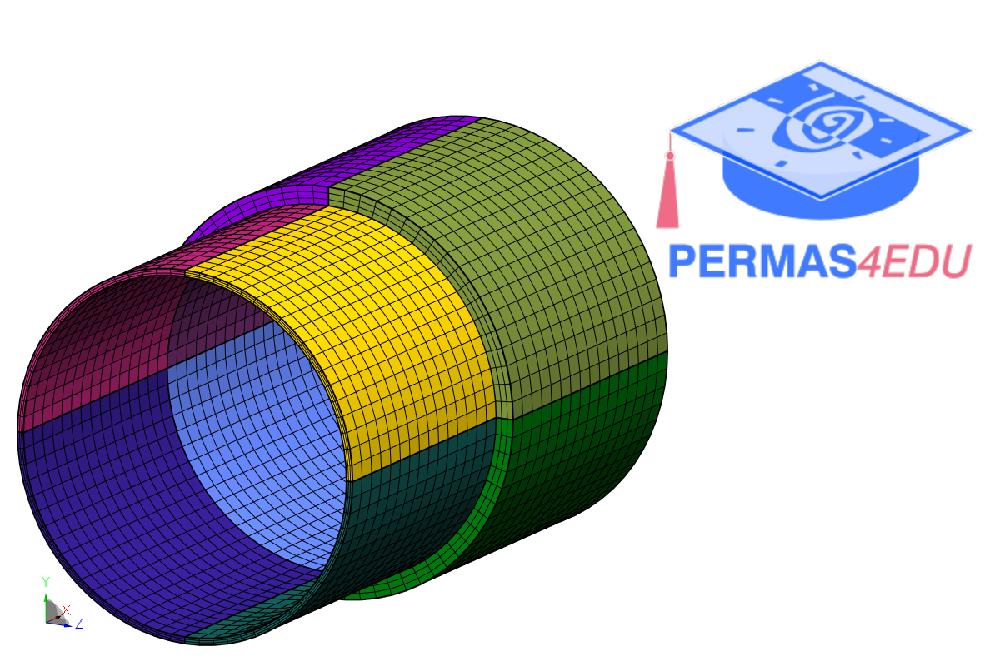

The  example is adapted from [Experimental and theoretical approaches to vibration models for multi-domain asymmetrical stepped cylindrical shells: Customizing mass distribution](http://dx.doi.org/10.1177/10775463251345006)

