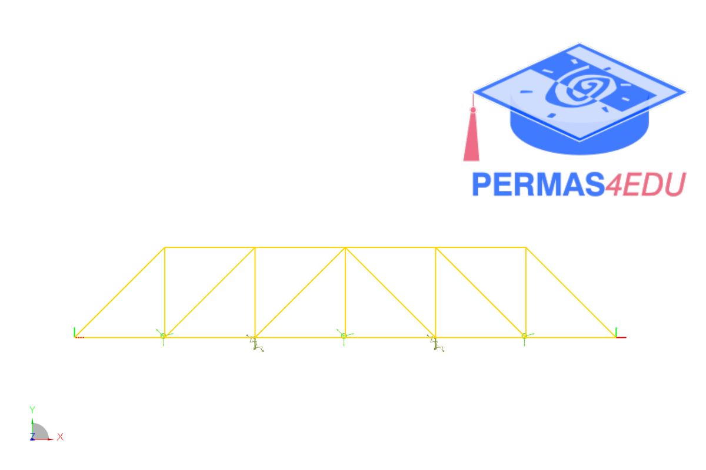

***
[⬅️](../071/README.md "Previous example")
[➡️](../073/README.md "Next example")
***

The example is adapted from [Sensitivity-based model updating with parameter rejection](https://doi.org/10.1016/j.apm.2025.116253)

